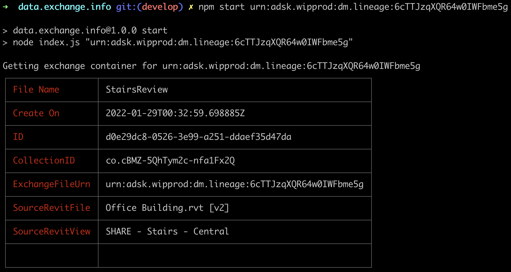
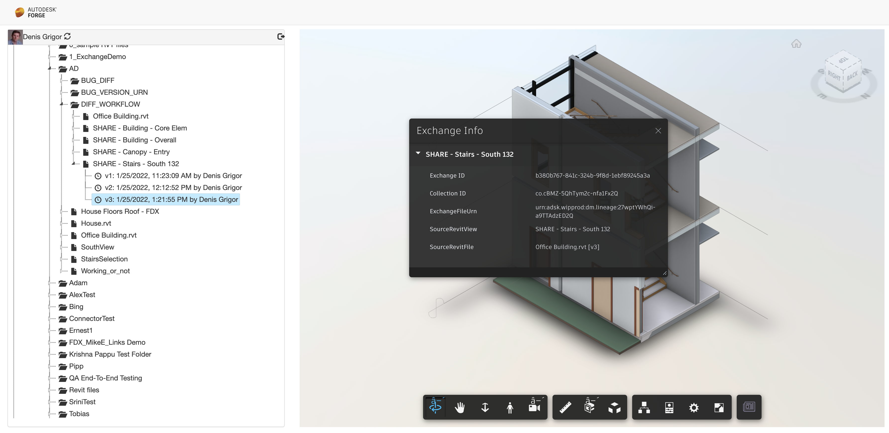

# Samples for Data Exchange Tutorial 1

---

There are two samples illustrating the use of the Data Extension API explored in tutorial 1:

Based on the part of Data Extension For tutorial 1, there are 2 samples, exploring just the part 
This repository contains a collection of tutorials, workflows, and samples illustrating access to exchanges and contained data using [Forge Data Exchange API](https://stg.forge.autodesk.com/en/docs/fdxs/v1/developers_guide/fd_overview/?sha=forge_fdxs_master_preview). 
The order is important for a soft introduction to Data Exchange API and its interoperability with other Forge APIs:

1. [data.exchange.info](./data.exchange.info): a very simple CLI app, concentrating only on Data Exchange API and illustrating how, using the `item id` related to an exchange, get the information on exchange container, whose data will be further used to get exchange data.
    
    
2. [data.exchange.explorer](./data.exchange.explorer): a more complex webapp, puting the information extracted from exchange container in a Forge Viewer context.
    

---

## Prerequisites

1. **Forge Account:** Learn how to create a Forge Account, activate subscription, and create an app in [this tutorial](http://learnforge.autodesk.io/#/account/):
    - Since the exchange data is located within Autodesk Construction Cloud, a three-legged `data:read` token is required.
2. [Node.Js](https://nodejs.org) with version > v14.16.0 and basic knowledge of JavaScript.

## License

These samples are licensed under the terms of the [MIT License](http://opensource.org/licenses/MIT). See the [LICENSE](LICENSE) file for full details.

## Written by

Denis Grigor [denis.grigor@autodesk.com](denis.grigor@autodesk.com), [Forge Partner Development](http://forge.autodesk.com)
