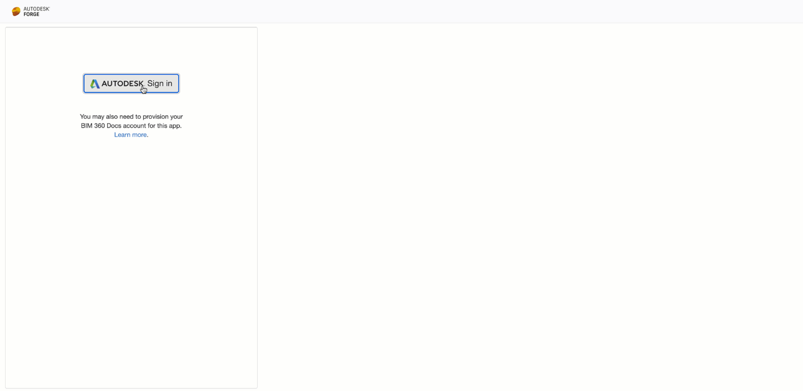

# data.exchange.explorer - Nodejs

[](https://nodejs.org/)
[](https://www.npmjs.com/)

[](http://opensource.org/licenses/MIT)

[](http://developer.autodesk.com/)
[](http://developer.autodesk.com/)
[](http://developer.autodesk.com/)
[](http://developer.autodesk.com/)
[](http://developer.autodesk.com/)


## Description

This sample is built upon the project used within [Learn Forge](http://learnforge.autodesk.io) tutorials, and extended to illustrate basics of the Data Exchange API.

This sample illustrates how, having an exchange item, to get the metadata of the data exchange container and get at least the `collectionId` and `exchangeContainerId`, which are further used to access exchange data using the Data Exchange API. 
There are two parts added to the original [Learn Forge sample](http://learnforge.autodesk.io): 

1. The [dataexchange](./routes/dataexchange.js) backend route - responsible for all Data Exchange API calls;
2. The [FDX_Explorer extension](public/js/fdx_explorer.js) - responsible for interaction and display of received data exchange container info.



## Setup

### Prerequisites

1. **Forge Account:** Learn how to create a Forge Account, activate subscription, and create an app in [this tutorial](http://learnforge.autodesk.io/#/account/). 
2. **Visual Code:** Visual Code (Windows or MacOS).
3. **JavaScript ES6:** Syntax for server-side.
4. **JavaScript:** Basic knowledge with **jQuery**.


For using this sample, you will need an Autodesk developer credentials. Visit the [Forge Developer Portal](https://developer.autodesk.com), sign up for an account, and [create an app](https://developer.autodesk.com/myapps/create). For this new app, use **http://localhost:3000/api/forge/callback/oauth** as the Callback URL; although, it's not used on a 2-legged flow. Finally, take note of the **Client ID** and **Client Secret**.

### Running locally

Install [NodeJS](https://nodejs.org), version 8 or newer.

Clone this project or download it (this `nodejs` branch only). It's recommended to install [GitHub desktop](https://desktop.github.com/). To clone it via command line, use the following command (**Terminal** on MacOSX/Linux, **Git Shell** on Windows):

    `git clone -b nodejs https://github.com/Autodesk-Forge/learn.forge.viewhubmodels.git`

To run it, install the required packages, set the enviroment variables with your client ID & secret, and finally, start it. Via command line, navigate to the folder where this repository was cloned and use the following command.

Mac OSX/Linux (Terminal):

    ```
    npm install
    export FORGE_CLIENT_ID=<<YOUR CLIENT ID FROM DEVELOPER PORTAL>>
    export FORGE_CLIENT_SECRET=<<YOUR CLIENT SECRET>>
    export FORGE_CALLBACK_URL=<<YOUR CALLBACK URL>>
    npm start
    ```

Windows (use **Node.js command line** from Start menu):

    ```
    npm install
    set FORGE_CLIENT_ID=<<YOUR CLIENT ID FROM DEVELOPER PORTAL>>
    set FORGE_CLIENT_SECRET=<<YOUR CLIENT SECRET>>
    set FORGE_CALLBACK_URL=<<YOUR CALLBACK URL>>
    npm start
    ```

Open the browser: [http://localhost:3000](http://localhost:3000).

### Packages used

The [Autodesk Forge](https://www.npmjs.com/package/forge-apis) packages are included by default. Some other non-Autodesk packages are also used including [express](https://www.npmjs.com/package/express) and [multer](https://www.npmjs.com/package/multer) for upload operations.

## Further Reading

Documentation:

- [BIM 360 API](https://developer.autodesk.com/en/docs/bim360/v1/overview/) and [App Provisioning](https://forge.autodesk.com/blog/bim-360-docs-provisioning-forge-apps)
- [Data Management API](https://developer.autodesk.com/en/docs/data/v2/overview/)
- [Viewer](https://developer.autodesk.com/en/docs/viewer/v6)

### Tips & Tricks

For local development/testing, consider using [nodemon](https://www.npmjs.com/package/nodemon) package which auto restarts your node application after any modification to your code. To install it, use this command:

    `sudo npm install -g nodemon`

Then, instead of **npm run dev**, use the following command:

    `npm run nodemon`

which executes **nodemon server.js --ignore www/**, where the **--ignore** parameter indicates that the app should not restart if files are modified under the **www** folder.

### Troubleshooting

After installing Github desktop for Windows, on the Git Shell, if you see an ***error setting certificate, verify locations*** error, use the following command:

    `git config --global http.sslverify "false"`

### License

This sample is licensed under the terms of the [MIT License](http://opensource.org/licenses/MIT). Please see the [LICENSE](LICENSE) file for full details.

## Written by

Petr Broz [@petrbroz](https://twitter.com/petrbroz), [Forge Partner Development](http://forge.autodesk.com)

## Modified by
