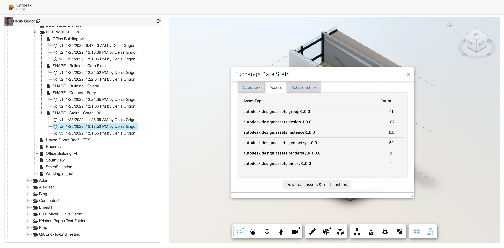

# Samples for Data Exchange Tutorial #2

---

There are two samples illustrating the use of the Data Extension API explored in Tutorial #2:

1. [data.exchange.downloader](./data.exchange.downloader) - a very simple CLI app concentrating only on the Data Exchange API and illustrating how, using the `item id` related to an exchange, to get the assets and relationships, save them as json, and present stats on the exchange data:
    
    
    
2. [data.exchange.explorer](./data.exchange.explorer) - a more complex web app extending the sample (with the same name) from Tutorial #1 sample pack. Added the ability to get the stats on assets and relationships related to visualized exchange in the Forge Viewer context, as well as download them for further client side processing:

    

---

## Prerequisites

1. **Forge Account:** Learn how to create a Forge Account, activate subscription, and create an app in [this tutorial](http://learnforge.autodesk.io/#/account/):
    
   - Since the exchange data is located within Autodesk Construction Cloud, a three-legged `data:read` token is required.

2. [Node.Js](https://nodejs.org) with version > v17.3.0 and basic knowledge of JavaScript.

## License

These samples are licensed under the terms of the [MIT License](http://opensource.org/licenses/MIT). See the [LICENSE](LICENSE) file for full details.

## Written by

Denis Grigor [denis.grigor@autodesk.com](denis.grigor@autodesk.com), [Forge Partner Development](http://forge.autodesk.com)
