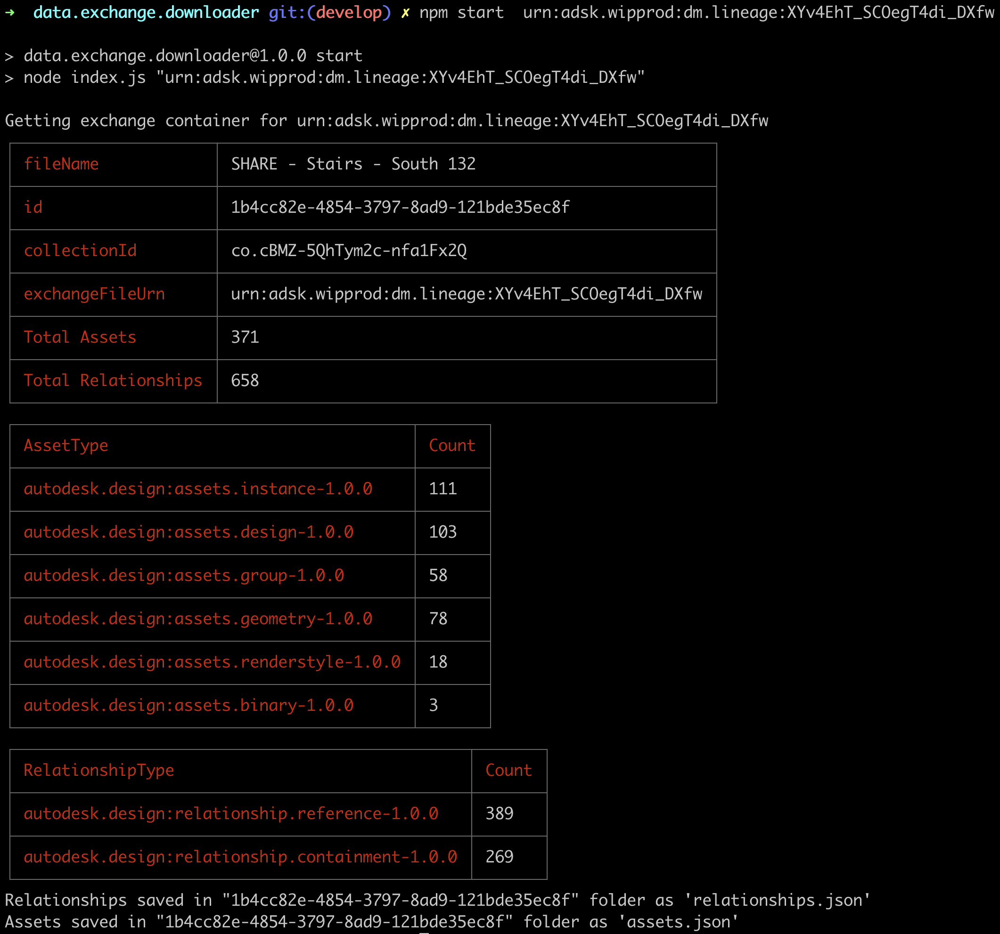

# data.exchange.downloader - Nodejs

**Forge API:** 

# Description

This sample is a CLI app, illustrating how, using the `item id` related to an exchange, get the assets and relationships, save them as json and present stats on exchange data.

# Setup

## Prerequisites

1. **Forge Account**: Learn how to create a Forge Account, activate subscription and create an app at [this tutorial](http://learnforge.autodesk.io/#/account/).
2. **NodeJs**: [version 8 or newer](https://nodejs.org).

For using this sample, you need an Autodesk developer credentials. 
Visit the [Forge Developer Portal](https://developer.autodesk.com), sign up for an account, 
then [create an app](https://developer.autodesk.com/myapps/create).

***NOTE***: To simplify the sample, since it requires 3-legged authentication, it was stripped of authentication part (requiring opening the browser) 
and will just expect a `$TOKEN` env variable to be present before running the sample.
The easiest way of acquiring a 3-legged authentication token is to follow the [3-legged authentication with Postman](https://forge.autodesk.com/blog/3-legged-authentication-postman) blog post.
After the access token is acquired, it can be set as environment variable, explained below.

## Running locally

Download this project or clone it using [git](https://git-scm.com/). 
It's recommended to install [GitHub desktop](https://desktop.github.com/). 

To run it, install the required packages and set the environment variables with token and finally start it. 
Via command line, navigate to the folder where this sample is located and run:

Mac OSX/Linux (Terminal)

    npm install
    export TOKEN=<<YOUR TOKEN HERE>>
    npm start <<ID OF THE ITEM>>

Windows (use **Node.js command line** from Start menu)

    npm install
    set TOKEN=<<YOUR TOKEN HERE>>
    npm start <<ID OF THE ITEM>>

The expected output should look like:

## Packages used

This sample is using no external library except `cli-table` for the nice table output.

## License

This sample is licensed under the terms of the [MIT License](http://opensource.org/licenses/MIT). Please see the [LICENSE](LICENSE) file for full details.

## Written by

[Forge Partner Development](http://forge.autodesk.com)