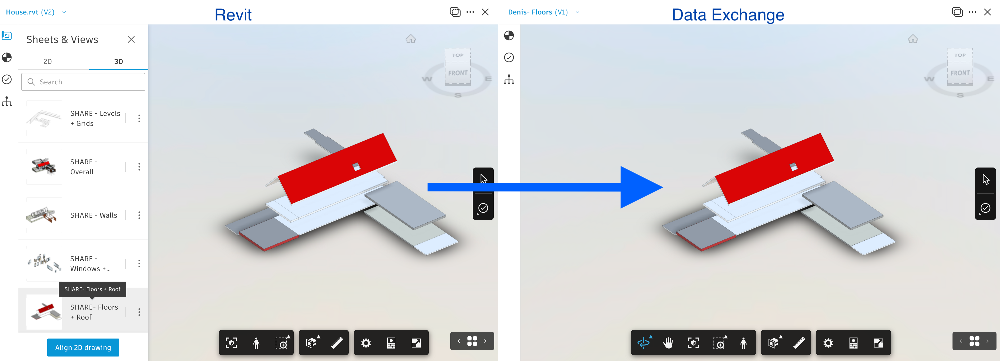
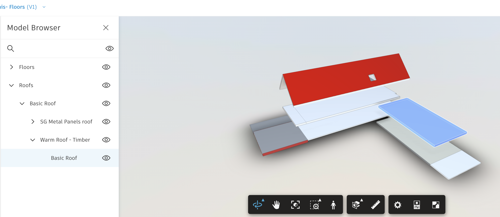
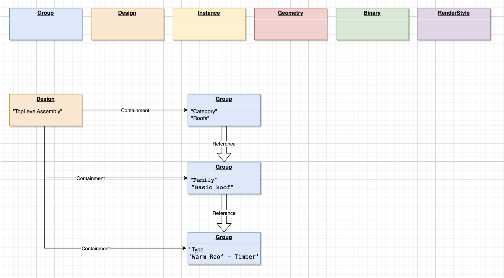
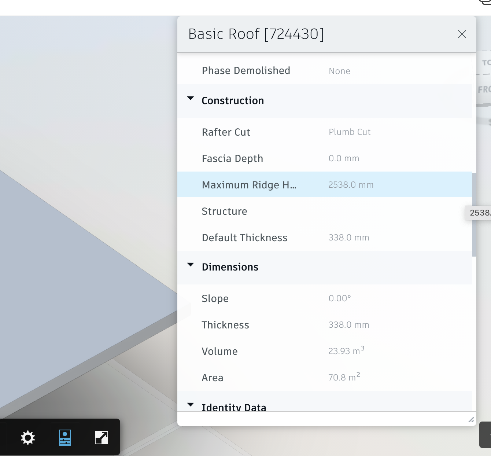
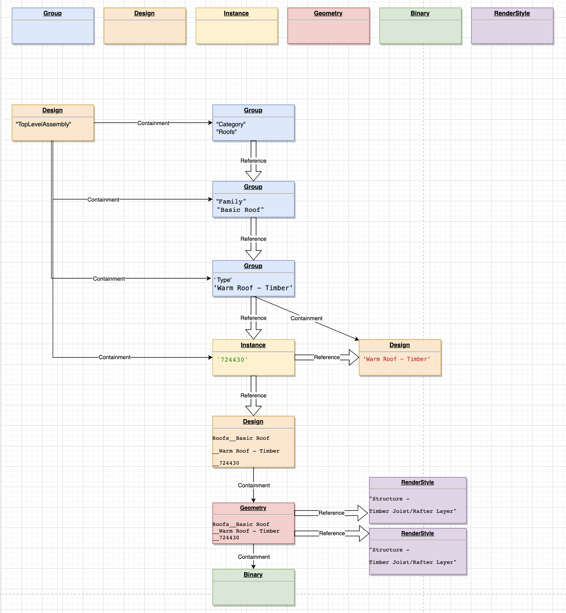

# Understand the structure of exchange data

This tutorial will help you understand how the data is structured using assets and relationships, and the role of snapshots and revisions:

- [Intro](#intro)
- [Data Graph](#data-graph)


## Intro

In a previous tutorial, it was mentioned that the data within an exchange container is organized as a graph. It's a collection of assets, grouped in spaces and linked through relationships.

Collections, assets, spaces, relationships, and snapshots share the same structure - being generalized as entities. Entities have the following schema: 

```json
{
    "id": "<<SOME_ID>>",
    "type": "<<SOME_TYPE_AND_VERSION>>",
    "attributes": {
        "data": []
    },
    "components": {
        "data": {
        }
    }
}

```

Further, each entity type, based on its functionality, will add new elements to this schema. For example, in case of relationships, there will also be present the `from` and `to` fields, pointing to the entities being in relationship.

The `attributes` part is used to store the system or application-specific properties, and it's an array of properties with fixed schema as follows:

```json
{
    "category": "system",			// or application
    "name": "<<SOME_NAME>>",
    "value": "<<SOME_VALUE>>",
    "type": "String" 				// or integer, float etc.
},
```

The `type` describes the role of the entity in the graph, and the main difference between one type and another (entity of the same group) is usually the set of properties it can store (components it can have).

The `components` is the part where the properties are stored using the schema-based structure.

Based on the entities `type`, in `components` section, it can contain one or more properties defined by schemas like the following:

- autodesk.design:components.base-1.0.0
- autodesk.design:components.color.rgba-1.0.0
- autodesk.design:components.geometry-1.0.0
- autodesk.design:components.modelstructure-1.0.0
- autodesk.design:components.parameter-1.0.0
- autodesk.design:components.referenceNameOnlyParameter-1.0.0
- autodesk.design:components.referenceParameter-1.0.0
- autodesk.design:components.renderstyle.property-1.0.0
- autodesk.design:components.subasset-1.0.0
- autodesk.design:components.transformation-1.0.0
- autodesk.design:components.type-1.0.0
- autodesk.design:components.unit-1.0.0

In what follows, let's look closer at assets and relationships, see what `type` each one can be, what set of components each type holds, as well as the role and relations between assets.


### Assets

Assets are the entities whose primary scope is to store properties. In the Data Exchange environment, an asset can be one of the following seven types:

 - 'autodesk.design:assets.binary-1.0.0'
 - 'autodesk.design:assets.instance-1.0.0'
 - 'autodesk.design:assets.geometry-1.0.0'
 - 'autodesk.design:assets.renderstyle-1.0.0'
 - 'autodesk.design:assets.design-1.0.0'
 - 'autodesk.design:assets.binary-1.0.0'
 - 'autodesk.design:assets.group-1.0.0'

 The `type` denotes the role of the asset, and determines the type of components it can have and, consequently, what kind of properties it can store.
 
 In case of assets, the components can be one or more of the following types:

- autodesk.design:assets.binary-1.0.0
- autodesk.design:components.base-1.0.0
- autodesk.design:components.color.rgba-1.0.0
- autodesk.design:components.geometry-1.0.0
- autodesk.design:components.parameter-1.0.0
- autodesk.design:components.referenceNameOnlyParameter-1.0.0
- autodesk.design:components.referenceParameter-1.0.0
- autodesk.design:components.renderstyle.property-1.0.0
- autodesk.design:components.transformation-1.0.0
- autodesk.design:components.unit-1.0.0

TODO: Show where to get the schema description, and when it will be available through the public FSS.

As the simplest example, an asset of type `autodesk.design:assets.binary-1.0.0` will have only one component `autodesk.design:assets.binary-1.0.0`, and this is enough to fulfill its role of storing data related to location, status, and type of the binary data.

TODO: Explain the `autodesk.design:components.base-1.0.0` component which is present in all, except binary assets.

ENDTODO


### Relationships

Relationships are entities whose primary scope is to keep track of **connections** between different assets. For this purpose, additional to the fields general to entities, each relationship has also two additional special fields as follows:

```json
"from": {
    "asset": {
        "id": "<<SOME_ASSET_ID>>",
    }
},
"to": {
    "asset": {
        "id": "<<ANOTHER_ASSET_ID>>",
    }
},
```

indicating the direction of relationship, the type, and the `id` of the "connected" entities.

The relationships can be of the following types:

- 'autodesk.design:relationship.reference-1.0.0'
- 'autodesk.design:relationship.containment-1.0.0'

As in case with assets, the `type` of the relationship indicates its role and the set of components it can have (out of the following component types) as follows:

- autodesk.design:components.modelstructure-1.0.0
- autodesk.design:components.subasset-1.0.0
- autodesk.design:components.type-1.0.0

---------------


## Data Graph

To simplify the task of understanding the role of each asset in the graph and relationships, you will use an exchange created based on the Revit view. For illustration, let's rely on Forge Viewer, and show at least the match between data available through Model Derivative and - through Data Exchange:



Having this model and the knowledge you got so far, you can extract all relationships and assets (as explained in the previous tutorial), allowing you to get the basic stats.

The data exchange created out of **SHARE - Floors + Roof** contains 122 assets and 185 relationships (the dump can be found [here](./dump/Floor_n_roof)). You can go with data mining further and notice that the breakdown is the following:

| Assets        |      Type     			                   | Count |
|---------------|:----------------------------------------:|------:|
| 			      |'autodesk.design:assets.design-1.0.0'     | 41    |
| 			      |'autodesk.design:assets.geometry-1.0.0'   | 10    |
| 			      |'autodesk.design:assets.instance-1.0.0'   | 30    |
|    		      |'autodesk.design:assets.group-1.0.0'      | 21    |
|               |'autodesk.design:assets.binary-1.0.0'     | 11    |
|    		      |'autodesk.design:assets.renderstyle-1.0.0'|  9    |
|    		      |							                   |       | 
| Relationships |							                   |       |
|    		      |'autodesk.design:relationship.containment-1.0.0'|   81    | 
|    		      |'autodesk.design:relationship.reference-1.0.0'| 104      | 

 

Traversing the entire graph (122 assets and 185 relationships) can be daunting, so let's explore just a small subset of it, but detailed enough to be able to get the full picture.

Let us identify the assets and relationships participating in storing data of the `Basic Roof` part, including all the elements present in its hierarchy:



Within the Data Exchange domain, any data graph formed by the assets and relationships always has a root asset.
The `id` of the root asset can be found when retrieving the relationships at the end of the payload similar to the following:

```json
...
      }
    ],
    "root": "1F27591A01D9596B97522612977B7BCF88F33EA0"
}
```

For this data exchange, the root asset has the `id`=`1F27591A01D9596B97522612977B7BCF88F33EA0`, and after searching it among the assets, you can see that it's a `autodesk.design:assets.design-1.0.0` type asset, and it has the following component:

```json

"autodesk.design:components.base-1.0.0": {
            "objectInfo": {
              	"String": {
                			"sourceId": "",
                			"name": "TopLevelAssembly",
                			"revision": ""
              }
            }
          }
```

If you search all relationships which this asset is part of, you can notice that it participates in 51 relationships where it's the source of destinations, and all the relationships are of type `autodesk.design:relationship.containment-1.0.0`.
Looking at the destination of all these relations, you can see that they connect to two types of assets as follows:

|  Asset Type | Count   |
|---|:-:|
| 'autodesk.design:assets.instance-1.0.0'  | 30  |
| 'autodesk.design:assets.group-1.0.0'  | 21  |

Starting with 'autodesk.design:assets.group-1.0.0' type assets, you can find among them an asset with the following content:

```json
{
    "id": "1A39D299362760BA7C7DEF9AC366B6D6963D90A5",
    "type": "autodesk.design:assets.group-1.0.0",
    ...
    "components": {
      "data": {
        "insert": {
          "String": {
            "description": "Category"
          },
          "autodesk.design:components.base-1.0.0": {
            "objectInfo": {
              "String": {
                "sourceId": "",
                "name": "Roofs",
                "revision": ""
}}}}}},},
```

As you can see from components of this asset, it corresponds to the `Roof` node in the **Model Browser** from our model.

Having this asset as a start, you can see that it's related to another asset through `autodesk.design:relationship.reference-1.0.0` relationship type, which also turns out to be an `autodesk.design:assets.group-1.0.0` type asset with the following structure:

```json
{
    "id": "B59358A416185DD8B7F24E775EDBE86E11D35411",
    "type": "autodesk.design:assets.group-1.0.0",
   ...
    "components": {
      "data": {
        "insert": {
          "String": {
            "description": "Family"
          },
          "autodesk.design:components.base-1.0.0": {
            "objectInfo": {
              "String": {
                "sourceId": "",
                "name": "Basic Roof",
                "revision": ""
}}}}}},}
```

From this chain, you can conclude that the `autodesk.design:assets.group-1.0.0` (as its name states) is used to store information on **parent nodes** in tree component hierarchies like **Roofs > Basic Roof > Warm Roof - Timber**, and you can deduce that the asset responsible for storing data related to **Warm Roof - Timber** is also an `autodesk.design:assets.group-1.0.0` type asset related to parent node **Basic Roof** through the `autodesk.design:relationship.reference-1.0.0` relationship type. This is indeed the case and the content of this asset is like the following:

```json
{
    "id": "301A606CD6AC8CC0F08BC3D1C0E32D7959E4AF70",
    "type": "autodesk.design:assets.group-1.0.0",
    ...
    "components": {
      "data": {
        "insert": {
          "String": {
            "description": "Type"
          },
          "autodesk.design:components.base-1.0.0": {
            "objectInfo": {
              "String": {
                "sourceId": "",
                "name": "Warm Roof - Timber",
                "revision": ""
}}}}}},}
```

Thus, the levels of hierarchies **Roofs > Basic Roof > Warm Roof - Timber** are captured in the graph as **Category > Family > Type** reference relationships:



Following further the relationships from **Warm Roof - Timber** group asset, you find that apart from two incoming relationships (from the root asset and - the **parent** node), it also has these two outgoing connections:

1. Reference relationship to an `autodesk.design:assets.instance-1.0.0` type asset:

	**NOTE:** The output was trimmed for brevity: 

	```json
	
	{
    "id": "5A5BA839488FD363B2C45645FB834282BB5A06E2",
    "type": "autodesk.design:assets.instance-1.0.0",
    "attributes": {
      "data": [
        {
          "name": "ExternalId",
          "value": "1551350c-45e5-41b8-bdf1-bcfa6794dc6a-000b0dce",
          "type": "String",
          "category": "system"
        }
      ]
    },
    "components": {
      "data": {
        "insert": {
          "autodesk.design:components.base-1.0.0": {
            "objectInfo": {
              "String": {
                "sourceId": "1551350c-45e5-41b8-bdf1-bcfa6794dc6a-000b0dce",
                "name": "724430","revision": ""}}},
          "autodesk.design:components.parameter-1.0.0": {
            "hostVolumeComputed": {
              "autodesk.revit.parameter:hostVolumeComputed-1.0.0": {
                "parameterValue": {"Float64": {"value": 23.926344000000547}}}},
            "hostAreaComputed": {
              "autodesk.revit.parameter:hostAreaComputed-1.0.0": {
                "parameterValue": {"Float64": {"value": 70.78800000000155}}}},
            "roofAttrThicknessParam": {
              "autodesk.revit.parameter:roofAttrThicknessParam-1.0.0": {
                "parameterValue": {
                  "Float64": {"value": 0.3380000000000001}}}},
            "roofEaveCutParam": {
              "autodesk.revit.parameter:roofEaveCutParam-1.0.0": {
                "parameterValue": {"Int32": {"value": 33615}}}},
            "roofSlope": {
              "autodesk.revit.parameter:roofSlope-1.0.0": {
                "parameterValue": {"Float64": {"value": 0}}}},
            "ifcExportElement": {
              "autodesk.revit.parameter:ifcExportElement-1.0.0": {
                "parameterValue": {"Int32": {"value": 0}}}},
            "ifcGuid": {
              "autodesk.revit.parameter:ifcGuid-1.0.0": {
                "parameterValue": {
                  "String": {
                    "value": "0LKJKCHUL1kBtnlFfddz6a"
                  }}}},
            "actualMaxRidgeHeightParam": {
              "autodesk.revit.parameter:actualMaxRidgeHeightParam-1.0.0": {
                "parameterValue": {
                  "Float64": {"value": 2.5379999999999354}}}}
          }}}}} 
	```

2. Containment relationship to an `autodesk.design:assets.design-1.0.0` type asset:

	**NOTE:** The output was trimmed for brevity: 

	```json
	{
    "id": "A58D20BA8915EC18B4A4403B8574BD0808C9DCBA",
    "type": "autodesk.design:assets.design-1.0.0",
    ...
    "components": {
      "id": "A58D20BA8915EC18B4A4403B8574BD0808C9DCBA",
      "url": "/assets/A58D20BA8915EC18B4A4403B8574BD0808C9DCBA/components",
      "data": {
        "insert": {
          "autodesk.design:components.base-1.0.0": {
            "objectInfo": {
              "String": {
                "sourceId": "",
                "name": "Warm Roof - Timber",
                "revision": ""  
              }}},
            "roofAttrDefaultThicknessParam": {
              "autodesk.revit.parameter:roofAttrDefaultThicknessParam-1.0.0": {
                "parameterValue": {
                  "Float64": {
                    "value": 0.3380000000000001
                  }}}},
            "analyticalAbsorptance": {
              "autodesk.revit.parameter:analyticalAbsorptance-1.0.0": {
                "parameterValue": {
                  "Float64": {
                    "value": 0.1
                  }}}},
            "analyticalRoughness": {
              "autodesk.revit.parameter:analyticalRoughness-1.0.0": {
                "parameterValue": {
                  "Int64": {
                    "value": [1,0]
                    }}}},
            "symbolNameParam": {
              "autodesk.revit.parameter:symbolNameParam-1.0.0": {
                "parameterValue": {
                  "String": {
                    "value": "Warm Roof - Timber"}}}}
        }}}}}
	```

At first sight, it looks like these two assets hold the information that corresponds to the properties of the **Basic Roof** element from the Revit design, but a closer look will unveil a lot of information that was not previously coming through the Model Derivative service:



TODO: Need to explain why the properties are split between two assets, and what is the difference between containment and reference relationships.

ENDTODO

Digging further into assets related to what you have so far, you find that what follows next is related to geometry, binary files, and rendering styles,- and for the moment, are not of much interest, but helps to form the picture of how everything is arranged and how and where to look for the needed properties:



-----------

In the [next tutorial](), you will see what is the purpose of snapshots and revisions, as well as how to easily identify the difference between two versions of the same exchange.

Refer to this page for more details: [Data Exchange](https://stg.forge.autodesk.com/en/docs/fdxs/v1/reference/quick_reference/?sha=forge_fdxs_master_preview).
