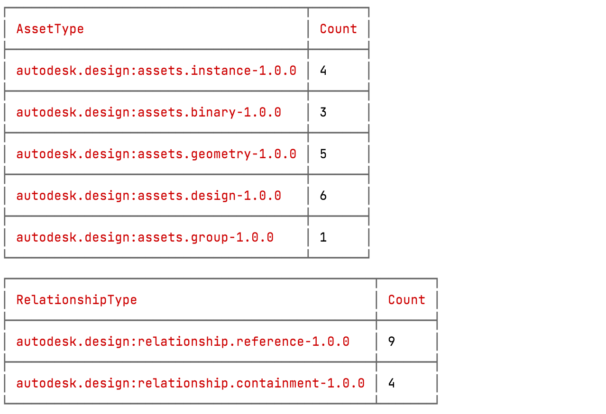

# Identify the difference between Data Exchange versions

This tutorial will help you understand the concept of snapshot and revisions. This knowledge will be further used to explain how to retrieve the asset and relationship changes between revisions (versions).

- [Intro](#intro)
- [Data Graph](#data-graph)
- [Snapshots & revisions](#snapshots-and-revisions)


## Intro

As discussed in the previous tutorials, the data within an exchange container is organized as a graph. It's a collection of assets linked through relationships. The state of the graph is captured in a snapshot, while different states of the graph (you can see these as versions) are retrieved using the snapshot revisions, which act as marks or pointers to a certain graph state.

To better understand the idea of a snapshot and revisions, let's follow how the graph is modified when a new exchange version is created upon changes of the source Revit file:


In this scenario, you will use an exchange created from a view of the Revit file. The Revit file is then changed by adding a door to a wall, and after save, the exchange is created using the Revit file, and is automatically updated to reflect the changes.

In what follows, let's look at how the graph is changing from v1 to v2, and how to identify only the changed entities (assets and relationships) during this process.


## Data Graph

To better understand how the graph changes from one version to another, take a look first at the stats around graph of v1 of the Data Exchange, and compare these to ones of v2:


Due to the number of total assets and relationships, the graph representation might be overwhelming, and in this case, you're interested only in the subgraph that has changed from v1 to v2, affecting these assets of type: 

- `autodesk.design:assets.group-1.0.0`, 
- `autodesk.design:assets.instance-1.0.0`, 
- `autodesk.design:assets.design-1.0.0`. 

You can ignore these assets of type for now:

- `autodesk.design:assets.binary-1.0.0`, 
- `autodesk.design:assets.renderstyle-1.0.0`,  
- `autodesk.design:assets.geometry-1.0.0`.

Before diving into the data graph, take a look at the source Revit file, and visually identify the changes from v1 to v2 using the diff tool available in ACC:


**NOTE:** This tool helps you visualize the differences when it comes to geometry, but the main drawback is that it provides no information on what properties have changed. You will see how this is covered by the Data Exchange below.

As the diff tool shows, the differences reflect the modification to the wall and addition of the door, and in version 1 of the exchange, the sub-graph related to these two components looks like the following:


**NOTE:** For brevity purpose, in the subgraphs presented above, the relationships and assets of binary, geometry, and renderStyle types are hidden from subgraphs.

In v2 of the Data Exchange, after the door is added, the subgraph related to doors changes as follows:


In case of the wall, however, as there are no hierarchical changes made to the wall in question, the subgraph remains the same, but the metadata changes. To identify the changes, compare the `autodesk.design:assets.design-1.0.0 ` to `autodesk.design:assets.instance-1.0.0` type assets related to the wall, and see how they change between versions.

In case of the asset instance related to the wall, you will find that the properties have changed from v1 to v2 as follows:


What you did so far was to manually identify the assets and relationships that changed between the two versions of the Data Exchange, but in what follows, you will see how using snapshot revisions can help spot the graph change in a snap.


## Snapshots and revisions

Each exchange will have just one corresponding snapshot, no matter how many times it is changed (how many versions of the exchange item exists in ACC). The snapshot can be seen as the pointer to the graph, while snapshot revisions can be seen as the markers or pointers to different states of the graph.

The snapshot information can be retrieved using the following call:

```shell
curl 'https://developer.api.autodesk.com/exchange/v1/collections/'$COLLECTION_ID'/exchanges/'$EXCHANGE_ID'/snapshots:exchange' \
--header 'Authorization: Bearer '$TOKEN
```

which returns information similar to the following:

```json
{
    "createdBy": {
        "userId": "EU84MQEGU4YJ",
        "serviceId": "IAlRfuDZ0eQw8z3YODJxvg6w8mm9gyRz",
        "date": "2022-01-26T15:45:52.824882Z"
    },
    "lastModifiedBy": {
        "userId": "EU84MQEGU4YJ",
        "serviceId": "IAlRfuDZ0eQw8z3YODJxvg6w8mm9gyRz",
        "date": "2022-01-26T17:17:28.868244Z"
    },
    "id": "8d19e5e3-5b25-36b4-aa0a-567f12bb2e23",
    "type": "autodesk.fdx:exchange.snapshot-1.0.0",
    "attributes": {
        ...
    },
    "components": {
        ...
    },
    "revisionId": "1643217446505_693eb279-0c63-368a-ba69-9b15b140a447",
    "deleted": false
}
```

For the moment, the information contained in the snapshot is not useful to you, but the revisions of the snapshot are the ones you are interested in, and these can be retrieved by making the following call:

```shell
curl 'https://developer.api.autodesk.com/exchange/v1/collections/'$COLLECTION_ID'/exchanges/'$EXCHANGE_ID'/snapshots:exchange/revisions' \
--header 'Authorization: Bearer '$TOKEN
```

which returns information similar to the following:

```json
{
    ...
    "results": [
        {
            "createdBy": {
                "userId": "EU84MQEGU4YJ",
                "serviceId": "IAlRfuDZ0eQw8z3YODJxvg6w8mm9gyRz",
                "date": "2022-01-26T17:17:28.868244Z"
            },
            "lastModifiedBy": {
                "userId": "EU84MQEGU4YJ",
                "serviceId": "IAlRfuDZ0eQw8z3YODJxvg6w8mm9gyRz",
                "date": "2022-01-26T17:17:28.868244Z"
            },
            "collectionId": "co.cBMZ-5QhTym2c-nfa1Fx2Q",
            "type": "autodesk.fdx:exchange.snapshot-1.0.0",
            "revisionId": "1643217446505_693eb279-0c63-368a-ba69-9b15b140a447",
            ...
        },
        {
            "createdBy": {
                "userId": "EU84MQEGU4YJ",
                "serviceId": "IAlRfuDZ0eQw8z3YODJxvg6w8mm9gyRz",
                "date": "2022-01-26T15:45:52.824882Z"
            },
            "lastModifiedBy": {
                "userId": "EU84MQEGU4YJ",
                "serviceId": "IAlRfuDZ0eQw8z3YODJxvg6w8mm9gyRz",
                "date": "2022-01-26T15:45:52.824882Z"
            },
            "collectionId": "co.cBMZ-5QhTym2c-nfa1Fx2Q",
            "type": "autodesk.fdx:exchange.snapshot-1.0.0",
            "revisionId": "1643211950373_23b6a25b-e417-3983-a6a0-960fa122f18e",
            ...
        }
    ]
}
```

From this payload, you can see in the `result` field that you have two revisions which can be seen as two markers to the states of the graph. The number of revisions corresponds to the number of exchange item versions you see in ACC, or through the Data Management API:


**NOTE:** For the time being, to determine which snapshot revision corresponds to which exchange item version, you have to either compare the timestamps or rely on positions of the snapshot revisions in the `results` array.

Having the `revisionId` values of different versions, you can use them as filters when retrieving assets and relationships as follows:

```shell
curl 'https://developer.api.autodesk.com/exchange/v1/collections/'$COLLECTION_ID'/exchanges/'$EXCHANGE_ID'/assets:sync?filters=exchange.snapshot.fromRevision==
'$REVISION_V1_ID'&filters=exchange.snapshot.toRevision=='$REVISION_V2_ID' \
--header 'Authorization: Bearer '$TOKEN
```

where `REVISION_V1_ID` and `REVISION_V2_ID` env variables correspond to `revisionId` of each revision, which returns back data similar to the one that's provided when asking for assets. However, the content is limited only to assets that were inserted or modified in the revision, specified in the `toRevision` property if compared with the one specified in the `fromRevision`:

```json
{
    "results": [{
        ...
        "id": "D8FEF4BE1983C0B56F7004F5C8C059100BE25C9B",
        "revisionId": "1643211950373_23b6a25b-e417-3983-a6a0-960fa122f18e",
        "type": "autodesk.design:assets.instance-1.0.0",
        ...
        "components": {...},
        "operation": "INSERT"
      },
    {
        ...
        "id": "19E01E74E4B3597EA890CB8639BBC05006E24F6D",
        "revisionId": "1643217446505_693eb279-0c63-368a-ba69-9b15b140a447",
        "type": "autodesk.design:assets.design-1.0.0",
        ...
        "components": {...},
        "operation": "MODIFY"
      },
      ...
],
    "root": "3566AEDB090B9480B03272C8E8D02685571730B6"
}
```

In the above payload, we can notice that the provided assets can be divided into three categories, specified by the field `operation`:

- **INSERT** - denotes that the asset was added in this revision when compared with the previous state;
- **MODIFY** - indicates that the asset was present in the previous revision, but some data was changed;
- **REMOVE** - indicates that the asset no longer exists when compared with the previous revision.

**NOTE:** In Forge Data Exchange context, all entities have a `revisionId` field which helps to keep track of different versions of the entity. For example, in case an asset with a certain ID goes through some changes, it will be assigned another revisionId which can be interpreted as having two versions of the same asset, each holding info specific to their version.

The same concept is valid when retrieving the relationships. Such, a call as the following:

```shell
curl 'https://developer.api.autodesk.com/exchange/v1/collections/'$COLLECTION_ID'/exchanges/'$EXCHANGE_ID'/relationships:sync?filters=exchange.snapshot.fromRevision==
'$REVISION_V1_ID'&filters=exchange.snapshot.toRevision=='$REVISION_V2_ID' \
--header 'Authorization: Bearer '$TOKEN
```

returns relationships that were added and removed between the mentioned revisions:

```json
{
    "results":[
    ...
      "id": "04ad831c-ec33-368a-9a64-49684f9c0007",
      "type": "autodesk.design:relationship.reference-1.0.0",
      "from": {
        "asset": {
          "id": "16E83FF0DDBA4D16621CFFE4C65B48396E6A68C7",
        }
      },
      "to": {
        "asset": {
          "id": "19E01E74E4B3597EA890CB8639BBC05006E24F6D",
        }
      },
      "revisionId": "1643217446505_693eb279-0c63-368a-ba69-9b15b140a447",
      "operation": "INSERT",
      ...
    },
    {
    ...
      "id": "d0bdcad6-383a-3da4-99de-0fb4a6b862ec",
      "type": "autodesk.design:relationship.reference-1.0.0",
      "from": {
        "asset": {
          "id": "A1DF2B374AF3EAB5D2F06AC2BCB26E3471F40599",
        }
      },
      "to": {
        "asset": {
          "id": "B65C3A8F29EB6DB628CF0C93EB46A44BFB38E73B",
        }
      },
      "revisionId": "1643217446505_693eb279-0c63-368a-ba69-9b15b140a447",
      "operation": "REMOVE",
    },
    ...
  ]
}
```

After getting all assets and relationships that form the difference between v1 and v2, you can see from the stats how many new and modified entities you have:


A breakdown by type of entity provides a good overview on the changes made as follows:



A brief and modest illustration of important entities that were affected by changes in your Data Exchange can be plotted as follows:


In the chart above and in your exploration in general, you can ignore (for now) the assets of type `autodesk.design:assets.binary-1.0.0`, `autodesk.design:assets.renderstyle-1.0.0`, and `autodesk.design:assets.geometry-1.0.0`, and focus instead only on the rest of the asset types which give you a hint on the nature of changes:

- `autodesk.design:assets.group-1.0.0` - a change or addition of this type of assets indicates a modification of parts hierarchy. In this example, the group asset referenced one door instance, and now it references two, which can be observed in the Model Browser as follows:
	
	

- `autodesk.design:assets.instance-1.0.0` and `autodesk.design:assets.design-1.0.0` - a change or addition of these types of assets indicate that some properties were added or modified. In our example, the properties of the wall have changed when we added the door, which was reflected in the modification of asset instance containing the instance wall properties as follows:

	

To conclude, these hints help in targeting the needed type of changes that you are looking for when dealing with data difference between two revisions (versions). 
If interested in modification of the hierarchical structure of the parts, look for the group assets. If interested in property changes, look for the instance and design assets.

-----------

Refer to this page for more details: [Data Exchange](https://stg.forge.autodesk.com/en/docs/fdxs/v1/reference/quick_reference/?sha=forge_fdxs_master_preview).
