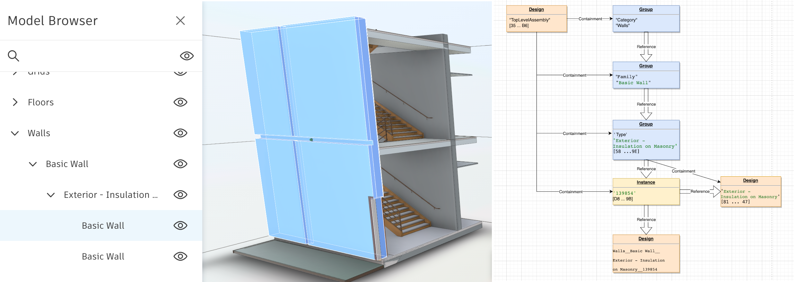

# Identify the diffence between versions of data exchange

This tutorial will help you understand the concept of snapshot and revisions. This knowledge will be further used to explain how to retrieve the assets and relationships changed between revisions (versions).

- [Intro](#intro)
- [Data Graph](#data-graph)
- [Snapshots & revisions](#snapshots-and-revisions)


## Intro

As discussed in previous tutorials, the data within an exchange container is organized as a graph. It's a collection of assets, linked through relationships. The state of the graph is captured in a snapshot, while different states (you can see it as versions) of the graph are retrieved using the snapshot revisions, which act as marks or pointers to a certain graph state.

To better understand the idea of the snapshot and revisions, let us follow how the graph is modified when a new version of exchange is created upon change of the source Revit file:


In this scenario we will use an exchange created from a view of the Revit file. Then the Revit file was changed by adding a door to a wall and upon save, the exchange created using this Revit file, is automatically updated to reflect the changes.

In what follows, let us look at how the graph is changing from v1 to v2 and how to identify only the changed entities (assets and relationships).

## Data Graph

To better understand how the graph changes from a version to another, let us look first at the stats around graph of v1 of data exchange and the v2 of it:


Due to number of total assets and relationships, a graph representation of it might be overwhelming, and in our case, we are curios only in the subgraph that is changing from v1 to v2 and even here, we are more interested in assets of type 

- `autodesk.design:assets.group-1.0.0`, 
- `autodesk.design:assets.instance-1.0.0`, 
- `autodesk.design:assets.design-1.0.0 ` 

and can ignore for now the assets of type 

- `autodesk.design:assets.binary-1.0.0`, 
- `autodesk.design:assets.renderstyle-1.0.0`,  
- `autodesk.design:assets.geometry-1.0.0`.


Before diving into the data graph, let us have a look at the source Revit file and visually identify the changes from v1 to v2, using the diff tool available in ACC:


***Note**: This tool helps us visually see the difference, when it comes to geometry, but the main drawback is that it provides no information on what properties changed and we will see further how this is covered by the Data Exchange.

As we can see from the diff tool, the difference is given by the modification to wall and adding a door and in version 1 of the exchange, the sub-graph related to these two components looks like this:




***Note*** For brevity purpose, in above presented subgraphs, the relationships to and the assets of type binary, geometry and renderStyle were hidden from subgraph.

In v2 of the data exchange, after the door was added, the subgraph related to the doors will change to:


In case of the wall however, as there were no hierarchical changes made to wall in question, the subgraph remaines the same, but the metadata changed and to identify those changes we have to basically compare the `autodesk.design:assets.design-1.0.0 ` and `autodesk.design:assets.instance-1.0.0` type assets related to the wall in question and see how they changed between versions.

In case of the instance asset related to wall, we will find the properties changed from v1 to v2:


What we did so far is to manually identify the assets and relationships that changed between two versions of the data exchange, but in what follows, we will see how using snapshot revisions can help spot the graph change in a snap.


## Snapshots and revisions

Each exchange will have just one corresponding snapshot, no matter how many times it was changed (how many versions of the exchange item exists in ACC). The snapshot can be seen as the pointer to the graph, while snapshot revisions can be seen as the markers, or pointers to differnt states of the graph.

The snapshot information can be retrieved using the following call:

```shell
curl 'https://developer.api.autodesk.com/exchange/v1/collections/'$COLLECTION_ID'/exchanges/'$EXCHANGE_ID'/snapshots:exchange' \
--header 'Authorization: Bearer '$TOKEN
```

which will return information similar to the following:

```json
{
    "createdBy": {
        "userId": "EU84MQEGU4YJ",
        "serviceId": "IAlRfuDZ0eQw8z3YODJxvg6w8mm9gyRz",
        "date": "2022-01-26T15:45:52.824882Z"
    },
    "lastModifiedBy": {
        "userId": "EU84MQEGU4YJ",
        "serviceId": "IAlRfuDZ0eQw8z3YODJxvg6w8mm9gyRz",
        "date": "2022-01-26T17:17:28.868244Z"
    },
    "id": "8d19e5e3-5b25-36b4-aa0a-567f12bb2e23",
    "type": "autodesk.fdx:exchange.snapshot-1.0.0",
    "attributes": {
        ...
    },
    "components": {
        ...
    },
    "revisionId": "1643217446505_693eb279-0c63-368a-ba69-9b15b140a447",
    "deleted": false
}

```

For the moment, the information contained in the snapshot is not useful to us, but the revisions of the snapshot are the ones we are interested in and those can be retrieved having the following call:

```shell
curl 'https://developer.api.autodesk.com/exchange/v1/collections/'$COLLECTION_ID'/exchanges/'$EXCHANGE_ID'/snapshots:exchange/revisions' \
--header 'Authorization: Bearer '$TOKEN
```
which will provide information similar to the following:

```json
{
    ...
    "results": [
        {
            "createdBy": {
                "userId": "EU84MQEGU4YJ",
                "serviceId": "IAlRfuDZ0eQw8z3YODJxvg6w8mm9gyRz",
                "date": "2022-01-26T17:17:28.868244Z"
            },
            "lastModifiedBy": {
                "userId": "EU84MQEGU4YJ",
                "serviceId": "IAlRfuDZ0eQw8z3YODJxvg6w8mm9gyRz",
                "date": "2022-01-26T17:17:28.868244Z"
            },
            "collectionId": "co.cBMZ-5QhTym2c-nfa1Fx2Q",
            "type": "autodesk.fdx:exchange.snapshot-1.0.0",
            "revisionId": "1643217446505_693eb279-0c63-368a-ba69-9b15b140a447",
            ...
        },
        {
            "createdBy": {
                "userId": "EU84MQEGU4YJ",
                "serviceId": "IAlRfuDZ0eQw8z3YODJxvg6w8mm9gyRz",
                "date": "2022-01-26T15:45:52.824882Z"
            },
            "lastModifiedBy": {
                "userId": "EU84MQEGU4YJ",
                "serviceId": "IAlRfuDZ0eQw8z3YODJxvg6w8mm9gyRz",
                "date": "2022-01-26T15:45:52.824882Z"
            },
            "collectionId": "co.cBMZ-5QhTym2c-nfa1Fx2Q",
            "type": "autodesk.fdx:exchange.snapshot-1.0.0",
            "revisionId": "1643211950373_23b6a25b-e417-3983-a6a0-960fa122f18e",
            ...
        }
    ]
}

```

From this payload we see in the `result` field that we have two revisions, which can be seen as two markers to the states of the graph. The number of revisions corresponds to the number of exchange item versions we see in ACC or through Data Management API:


***Note:*** For the time being, to determine which snapshot revision corresponds to which exchange item version you have to either compare the timestamp or relaying on position of the snapshot revision in `results` array.

Having the `revisionId` of different versions, we can use them as filters when retrieving assets and relationships, as follows:


```shell
curl 'https://developer.api.autodesk.com/exchange/v1/collections/'$COLLECTION_ID'/exchanges/'$EXCHANGE_ID'/assets:sync?filters=exchange.snapshot.fromRevision==
'$REVISION_V1_ID'&filters=exchange.snapshot.toRevision=='$REVISION_V2_ID' \
--header 'Authorization: Bearer '$TOKEN
```

where `REVISION_V1_ID` and `REVISION_V2_ID` env variables correspond to `revisionId` of each revision, and it will return back data similar to one that is provided when asking for assets, but the content will be limited only to assets that were inserted or modified in revision specified in `toRevision` compared with one specified in `fromRevision`:

```json
{
    "results": [{
        ...
        "id": "D8FEF4BE1983C0B56F7004F5C8C059100BE25C9B",
        "revisionId": "1643211950373_23b6a25b-e417-3983-a6a0-960fa122f18e",
        "type": "autodesk.design:assets.instance-1.0.0",
        ...
        "components": {...},
        "operation": "INSERT"
      },
    {
        ...
        "id": "19E01E74E4B3597EA890CB8639BBC05006E24F6D",
        "revisionId": "1643217446505_693eb279-0c63-368a-ba69-9b15b140a447",
        "type": "autodesk.design:assets.design-1.0.0",
        ...
        "components": {...},
        "operation": "MODIFY"
      },
      ...
],
    "root": "3566AEDB090B9480B03272C8E8D02685571730B6"
}
```
In above payload we can notice that the provided assets can fall in three categories, specified by the field `operation`:

- **INSERT** - denotes that the asset was added in this revision compared with the previous state;
- **MODIFY** - indicates that the asset was present in previous revision, but some data was changed.
- **REMOVE** - indicates that the asset no longer exists compared with previous revision.

***Note:*** In Forge Data Exchange context, all entities have `revisionId` field, which helps keeping track of different versions of the entity. For example, in case an asset with a certain id, suffers some changes, it will be assigned another revisionId, which can be seen as two versions of the same asset, each holding info specific to their version.


Same thing is valid when retrieving the relationships. A call to 

```shell
curl 'https://developer.api.autodesk.com/exchange/v1/collections/'$COLLECTION_ID'/exchanges/'$EXCHANGE_ID'/relationships:sync?filters=exchange.snapshot.fromRevision==
'$REVISION_V1_ID'&filters=exchange.snapshot.toRevision=='$REVISION_V2_ID' \
--header 'Authorization: Bearer '$TOKEN
```

will return relationships that were added and removed between mentioned revisions:

```json
{
    "results":[
    ...
      "id": "04ad831c-ec33-368a-9a64-49684f9c0007",
      "type": "autodesk.design:relationship.reference-1.0.0",
      "from": {
        "asset": {
          "id": "16E83FF0DDBA4D16621CFFE4C65B48396E6A68C7",
        }
      },
      "to": {
        "asset": {
          "id": "19E01E74E4B3597EA890CB8639BBC05006E24F6D",
        }
      },
      "revisionId": "1643217446505_693eb279-0c63-368a-ba69-9b15b140a447",
      "operation": "INSERT",
      ...
    },
    {
    ...
      "id": "d0bdcad6-383a-3da4-99de-0fb4a6b862ec",
      "type": "autodesk.design:relationship.reference-1.0.0",
      "from": {
        "asset": {
          "id": "A1DF2B374AF3EAB5D2F06AC2BCB26E3471F40599",
        }
      },
      "to": {
        "asset": {
          "id": "B65C3A8F29EB6DB628CF0C93EB46A44BFB38E73B",
        }
      },
      "revisionId": "1643217446505_693eb279-0c63-368a-ba69-9b15b140a447",
      "operation": "REMOVE",
    },
    ...
  ]
}

```

After getting all assets and relationships that form the difference between v1 and v2 we can see from the stats how many new and modified entities we have:


A breakdown by type of the entity provide a good overview on changes:


A brief and modest illustration of important entities that were affected by changes in our data exchange, can be ploted as:


In above chart and in our exploration in general, we ignore (for now) the assets of type `autodesk.design:assets.binary-1.0.0`, `autodesk.design:assets.renderstyle-1.0.0`, `autodesk.design:assets.geometry-1.0.0` and focus only on rest of the assets type which give us a hint on the nature of changes:

- `autodesk.design:assets.group-1.0.0` - change or addition of this type of assets indicates a modification of parts hierarchy. In our example, the group asset was referencing one instance of door and now it references two, which can be observed in Model Browser as:
	
	


- `autodesk.design:assets.instance-1.0.0` and `autodesk.design:assets.design-1.0.0` - change or addition of these type of assets indicate that some properties were added or modified. In our example, the properties of the wall changed when we added the door, which was reflected in modification of instance asset containing the instance wall properties:

	


To conclude, these hints help in targeting the needed type of changes that you are looking for when dealing with data difference between two revisions (versions). 
If interested in modification of hierarchical structure of the parts, look for the group assets. If interested in propertie changes, look for the instance and design assets.


-----------


Refer to this page for more details: [Data Exchange](https://stg.forge.autodesk.com/en/docs/fdxs/v1/reference/quick_reference/?sha=forge_fdxs_master_preview).
